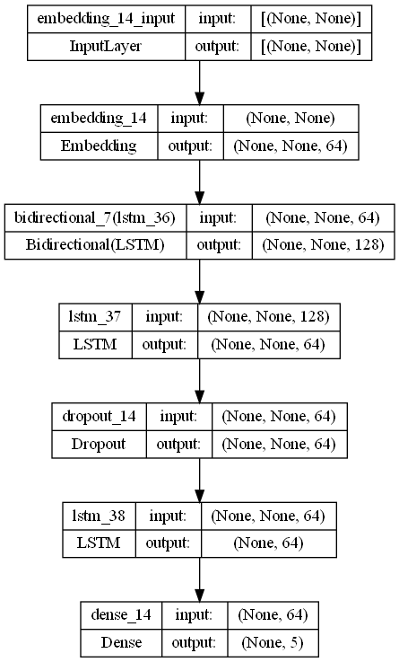
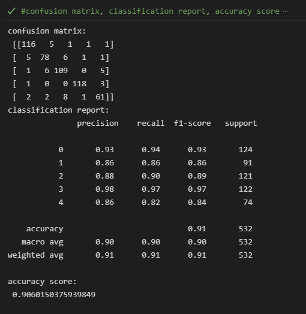

## 
 
 
 
 
 

# Article Classification Project
This project is to categorize unseen articles into some categories.
 
## Project Description
Text documents are essential as they are one of the richest sources of data for businesses. Text documents often contain crucial information which might shape
the market trends or influence the investment flows. Therefore, companies often hire analysts to monitor the trend via articles posted online, tweets on social media
platforms such as Twitter or articles from newspaper. However, some companies may wish to only focus on articles related to technologies and politics. Thus, filtering of the articles into different categories is required. 

Often the categorization of the articles is conduced manually and retrospectively; thus, causing the waste of time and resources due to this arduous task. Hence, the purpose of this project is to categorize unseen articles into 5 categories namely Sport, Tech, Business, Entertainment and Politics by using LSTM model and get the best accuracy at least more than 70% and at least 0.7 F1 score.

### Project Details 
(A). Data Loading  

<ul>
  <li>Load the dataset into this project using pandas by simply passing the URL dataset into <em>pd.read_csv</em>.</li>
</ul>

(B). Data Inspection  

<ul>
  <li>Check the data type of all columns</li>
  <li>Check if the dataset has duplicates data - found 99 duplicates</li>
  <li>Check if the dataset has any missing values - 0 missing values found</li>
</ul>

(C). Data Cleaning  

<ul>
  <li>Define the features x and target y</li>
  <ul>
      <li> Features - text </li>
      <li> Target - category </li>
  </ul>
  <li>Remove unimportant character in the text column</li>
  <li>Remove all duplicates data</li>
</ul>

(D). Features Selection  

<ul>
  <li>Select column 'text' and 'category' as features and target</li>
</ul>

(E). Data Pre-Processing  

<ul>
  <li>Change the text into numbers using Tokenization for Feature x(separate piece of texts into smaller units called tokens)</li>
  <li>Padding and Truncating</li>
  <li>Splitting the train and test data - X_train, X_test, y_train, y_test</li>
  <li>Pre-processing the Target y using One-Hot Encoder</li>
</ul>

(F). Model Development  

<ul>
  <li>Create Sequential Model</li>
  <li>Add Embedding layer</li>
  <li>Add Bidirectional LSTM layer</li>
  <li>Add LSTM layer</li>
  <li>Add Dropout layers</li>
  <li>Add Dense layers</li>
  <li>Model Summary</li>
</ul>

#### Model Architecture

My model architecture used in this project are as follows where I used Bidirectional, LSTM and Dropout as my hidden layers and Dense as my output layer with 64 nodes for each layer.

   
    
 

 
(G). Model Compilation  

<ul>
  <li>Compile the model</li>
    <ul>
      <li> Optimizer - adam </li>
      <li> Loss - 'categorical_crossentropy'</li>
      <li> Metrics - 'acc'</li>
    </ul>
</ul>

(H). Callbacks - Early Stopping and TensorBoard 

<ul>
  <li>Tensorboard logs after every batch of training to monitor metrics</li>
  <li>Save model to disk</li>
</ul>

(I). Model Training  

<ul>
  <li>Train the model for 10 epochs and get the model accuracy</li>
</ul>

(J). Model Evaluation  

<ul>
  <li>Get the model prediction</li>
  <li>Evaluate the model confusion matrix</li>
  <li>Evaluate the model classification report</li>
  <li>Evaluate the model accuracy score</li>
</ul>

#### Model Performance

My model performance that I get from this project are as follows where I used Confusion Matrix, Classification Report, and Accuracy Score to evaluate the performance. This value can still be improved by adjusting the hidden layers in Model Development. 

  

(K). Model Saving

<ul>
  <li>Save the model</li>
    <ul>
      <li>Tokenizer Model</li>
      <li>One-Hot-Encoding</li>
      <li>Deep-Learning Model</li>
    </ul>
</ul>

## Results
### TensorBoard Accuracy

  

### TensorBoard Loss

  

## Acknowledgement
Special thanks to **(https://raw.githubusercontent.com/susanli2016/PyCon-Canada-2019-NLP-Tutorial/master/bbc-text.csv)** for the data source used for this project.

